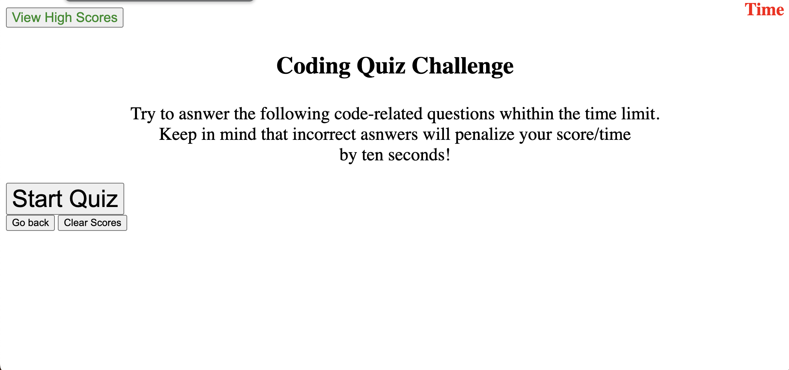

# Description
    This trivia game was built as a practice for applying what I learned from class to build a functional game with JavaScript. It has a built in timer and place to view your highscores.
# Usage
    Within this game you can view your highscores along with initials of the highest score. There is also a built in timer and messages that provide the correct answer if you get a question wrong.
## Screenshots
 

# Links
https://williamhirschh.github.io/Coding-Quiz-Challenge/

## Features
-Built in timer
 -Highscore page
 -Correct Answers
 -Submit button for initials

## license
    MIT License